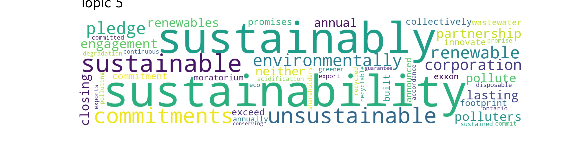

# Who does really care about climate change ?
## A gender driven journey throughout environment related topics in the media

## Introduction

Dear ADAdventurer, 

We welcome you onboard a datatrip throughout ecology, environment and climate change. During this journey, you'll be following men and women speakers from a bunch of English newspapers and websites, from 2015 to 2020. 

Before diving in, let's pause for a second. Why did we join this ADAdventure ? It comes from some personal observations, that you might share, or not ! People around us, and more especially students, tend to feel more or less concerned and to involve themselves in a different way, regarding ecology and environment. Indeed, the proportion of women commited into reducing their wastes, buying second hand or avoiding meat seemed quite high to us. So we decided to read about it. A [study](https://onlinelibrary.wiley.com/doi/10.1111/jiec.13176#jiec13176-bib-0044) from Sweden suggested than men tend to have a larger carbon footprint. On the other hand, from studies( [here](https://onlinelibrary.wiley.com/doi/10.1111/jiec.13176#jiec13176-bib-0044) and [there](https://www.weforum.org/agenda/2015/12/climate-friendly-men-or-women/)) conducted in some of the industrialised countries came the conclusion that women tend to be more concerned about those environmental issues. Indeed, they make a big part into daily life tasks and show more willingness to take action against climate change. The [United Nation Development Program](https://www.undp.org/blog/climate-change-isnt-gender-neutral-climate-action-shouldnt-be-either?utm_source=EN&utm_medium=GSR&utm_content=US_UNDP_PaidSearch_Brand_English&utm_campaign=CENTRAL&c_src=CENTRAL&c_src2=GSR&gclid=Cj0KCQiA5OuNBhCRARIsACgaiqWJC_ANIcSFrJsHJ0c4TsNzz8cJAr3BkpdXir5XwvbpEqlVf4n593UaAofaEALw_wcB) highlights the fact that women tend to be more impacted by global warming consequences. However, a last [article](https://climatecommunication.yale.edu/publications/gender-differences-in-public-understanding-of-climate-change/) reported that even if women feeled concerned, they showed less scientific knowledge that men.

Therefore, men and women are expected to address those topics through different angles and with different rethoric tools. This has been highlighted several times when studying social media data such as reddit or tweet posts. However, here, we're dealing with reported speech. Indeed, what a quoted person said has been intentionnally selected by the journalist, taken out of context somehow and emphasized. 
Can we still find some clues from these quotes, supporting the hypothesis that each speaker approaches ecology and other environmental issues depending on his or her gender ?

_Side notes : we performed our analysis with binary gender (male or female) only for the sake of simplicity_.

And now, let's jump in !

## Our storyteller
### Quotebank processed dataset

Here is our raw storyteller ! From **21,470,292** quotes we extracted **335,250** quotes dealing with environment, so roughly **1.5 %**. Below we present the gender repartition per year on those quotes. Women tend to represent **one fifth** of the total number of speakers on the topic.

_TODO : would be nice to add the same plot across all cleaned quotes_
Let's go further and analyse who is taking the floor...

## How do environment-linked topics evolve from 2015 to 2020 ? Among those quotes, what is the proportion of men and women speakers ?

*TODO Alix plot* + comments
Not finished, I will add comments!  _Alix I removed your plots for the moment because it raised some build errors, and it didn't print on the website_

Who are the 30 most famous speakers over the five years? By famous we meand the number of occurences the quote occurs in the articles. 

## Show me what you're talking about and I'll tell you who you are

### Topics broken down to words

We're reaching a cross road, and before following the path of topic analysis, let's try to predict, from simple words, whether a given quote speaker was a man or a woman. Each quotation was broken into words and embedded into a Term-frequency Inverse Document Frequency Matrix. Below we present the results from the two simple classifiers we used. We used a perfectly balanced dataset to predict the gender and our accuracy is a bit but not much above random chance (ie. 50%). Logistic regression performed slightly better than random forest on the train set.

|                      | Random Forest | Logistic regression |
|----------------------|---------------|---------------------|
| Accuracy on test set | 0.556         | 0.567               |
| Precision            | 0.561         | 0.565               |
| Recall               | 0.485         | 0.564               |

 Given all the pieces of information coming from the words that we have at our disposal, across all quotes, we cannot make a very significative statement about the speaker gender. This can be explained by the following fact. Even if we artificially balanced the dataset, we have very few quotes attributed to women, and thus less diversity in the words. Therefore our classifiers weren't able to grasp a meaningful aspect linked to gender out of it. We can nevertheless explore how our more performant classifier made its choices, taking a look at each coefficient importance into the task of predicting whether the speaker is a woman or not. The more positive the coefficient, the more weight it gives towards predicting "womea", the more negative, the better it is to predict "man".



Two interesting facts can be highlighted there. First of all, the most prominent words are gender related, such as _girl_, _woman_, _guy_, or _husband_. Secondly, action verbs like _shall_, _execute_ and _operate_ are used to classify "man", while more diverse types of words are linked to predicting "woman". We managed to pick one interesting aspect from our guests !

### Where LDA comes into play

Now that we've become acquainted with our speakers, let's have a look at what they're talking about, regardless of gender. We use as baseline Latent Dirichlet Allocation to extract topics from those bulk quotes. We extracted and processed **248211 quotes**, among which we have **47374 women and 200837 men**. So **20%** (only...) of our guests are women, and the **80%** left are men. 
LDA managed to extract **7 topics** that are presented in details below :

| Topic number | Topic main word | Second word       | Third word             | Fourth word      | Description interpretation |
|--------------|-----------------|-------------------|------------------------|------------------|----------------------------|
| 0            | 0.068*"climate" | 0.064*"change"    | 0.039*"climate_change" | 0.016*"emission" | climate change             |
| 1            | 0.030*"people"  | 0.022*"want"      | 0.016*"need"           | 0.011*"way"      | action                     |
| 2            | 0.028*"year"    | 0.028*"go"        | 0.022*"people"         | 0.021*"think"    | long term consequences     |
| 3            | 0.025*"long"    | 0.018*"term"      | 0.018*"level"          | 0.013*"air"      | long term consequences     |
| 4            | 0.014*"use"     | 0.011*"food"      | 0.011*"plant"          | 0.011*"year"     | resources                  |
| 5            | 0.015*"work     | 0.013*"community" | 0.012*"new"            | 0.012*"help"     | solutions                  |
| 6            | 0.023*"water"   | 0.012*"feel"      | 0.010*"number"         | 0.009*"warming"  | resources                  |

We can really explore each topic using pyLDAvis tool. We can manually extract the meaningful topics, and see how close the topics are (in the blob graph below). Moreover, each topic word is nicely detailed. 



### Can we infer the gender from the quote ? 

As a starter, we'll have a look at how each topic evolved for each gender across years. 




The words refer to the first most meaningful word for each topic.
We don't learn much from a gender-split analysis, but we can still observe that the topic repartition and evolution 
is quite similar. "People" and "Work" topics seem quite popular among our speakers, and we see a small rise of "Climate" and "Year" topic towards the end of
our studied period. 
Let's see if logistic regression and random forest can bring us some more details about a gender difference. We took care of tuning random forest in order to select the best depth and number of estimators.  

|                      | Random Forest | Logistic regression |
|----------------------|---------------|---------------------|
| Accuracy on test set | 0.741         | 0.518               |
| Precision            | 0.741         | 0.524               |
| Recall               | 0.747         | 0.463               |

Random Forest performs as expected quite well, but the analysis of feature importance doesn't bring us much. Indeed, each feature seems to contribute equally to the decision made. 



### Top2Vec

We'll turn to a more powerful tool to explore topics brought by the speakers, namely Top2Vec. _TODO : add comment on the method and on the setup_



_TODO: comment on the distribution and do plot again. Comment on the raised topics and compare them to 7 topics above._

Top 6 topics...                                    |  ...for all genders

  |  
:-----------------------------------:|:--------------------------------------:
  |  
:-----------------------------------:|:--------------------------------------:
  |  

_TODO : set up for test and comment on the results_

|                      | Random Forest | Logistic regression |
|----------------------|---------------|---------------------|
| Accuracy on test set | 0.562         | 0.559               |
| Precision            | 0.557         | 0.56                |
| Recall               | 0.488         | 0.541               |

_TODO : comment on the top features, compare results to word based prediction and features_



### In the foreground for climate and environment

_TODO : present speakers_

_TODO : present test and comment on results and coefficients_



_TODO : conclude here_

## Sentiment analysis of quotations




## What are the words most used by males and females?

Once we understand and recognize the major topics of our speakers, let's go on to understand how, that is, with which verbs, adjectives, adverbs, nouns, these speakers go forward in addressing and discussing the different topics!

### Where and how WFA comes into play
We did a deep analysis to find out which are the most used words among the female and male speakers. We used a _Word Frequency Analysis_ tool just to count the occurrence of each noun, verb, adverb and adjective for all the speakers. 

For each study group of words considered (namely between verbs, nouns, adjectives and adverbs), we present a plot with the 30 most used words between male and female speakers. In the respective plots, it can be seen which verbs, adjectives, nouns and adverbs are most used by a male speaker and which by a female speaker and, furthermore, which are used almost equally between the two genders. Moreover we reported the _word clouds_ visualization, which shows a random display of all the words (between verbs, nouns, adjectives and adverbs, respetively) in a source of quotations, where the size of each word is proportional to the number of times it has been counted in the set of all quotations. These visualisations are interesting, and they can be a quick and direct way to give an overview of how our speakers are talking.

#### Verbs
Which _verbs_ are used most by men and which by women?



From the study of the verbs, it can be noticed that the three most used are _go_, _think_ and _need_. In this study case, the difference between the genders is very slight, however it can be observed that there is a prevalence of the use of the verbs _go_ and _get_ by male speakers than female spekers. 

  

#### Nouns
Which _nouns_ are used most by men and which by women?



Regarding the nouns, the most three used, for both gender, are _people_, _climate_, _change_. However, all three of the latter seem to be utilized more by females speakers, which could confirm our hypothesis that females are probably more involved in ecology topic. In addition to this, it is interesting to underline how the nouns _health_, _life_ and _science_ seem only used from female speakers. On the other hand, we observe that the nouns _level_, _carbon_, _business_ are only used from male speakers. 

  

#### Adjectives
Which _adjectives_ are used most by men and which by women?



Under the study of the adjectives, it can be seen that the three most used are _enviromental_, _good_ and _important_ for both gender. Furthermore, it can be noticed a greater use of the _global_ and _high_ adjectives from the side of the male speakers. 

  

#### Adverbs 
Which _adverbs_ are used most by men and which by women?



On the use of adverbs, it can be noted that the three most used by both genders are _forward_, _actutally_, and _away_ (with a majority from the female speakers), whereas _truly_, _hard_, _directly_, _exactly_, _way_ seem to be used only by male speakers and _well_, _likely_, _highly_, _increasingly_, _obviously_ only by female speakers.

  

## Conclusion

## Appendix

### Our data

### Our methods
