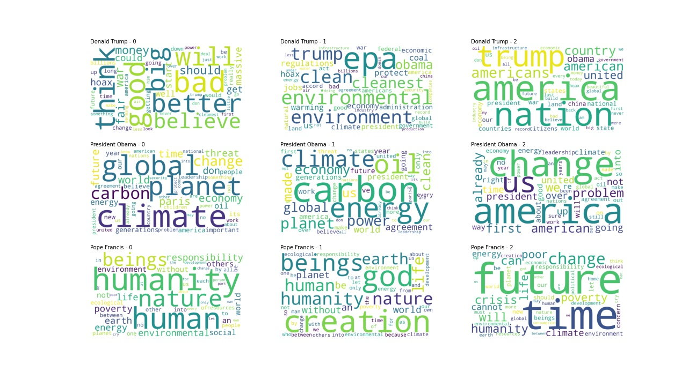

<!DOCTYPE html>
<html>
<head>

 
 <h1>  Who does really care about climate change ?  </h1>
  
## A gender driven journey throughout environment related topics in the media
 <h2> A gender driven journey throughout environment related topics in the media </h2>
 </head>
 <body>
  
## Introduction
  <h2> Introduction </h2>

 
Dear ADAdventurer, 
We welcome you onboard a datatrip throughout ecology, environment and climate change. During this journey, you'll be following men and women speakers from a bunch of English newspapers and websites, from 2015 to 2020. 

Before diving in, let's pause for a second. Why did we join this ADAdventure ? It comes from some personal observations, that you might share, or not ! People around us, and more especially students, tend to feel more or less concerned and to involve themselves in a different way, regarding ecology and environment. Indeed, the proportion of women commited into reducing their wastes, buying second hand or avoiding meat seemed quite high to us. So we decided to read about it.   

 <a href="https://onlinelibrary.wiley.com/doi/10.1111/jiec.13176#jiec13176-bib-0044">A study</a> from Sweden suggested than men tend to have a larger carbon footprint. On the other hand, from studies (<a href="https://onlinelibrary.wiley.com/doi/10.1111/jiec.13176#jiec13176-bib-0044">here</a> and <a href="https://www.weforum.org/agenda/2015/12/climate-friendly-men-or-women/">there</a>) conducted in some of the industrialised countries came the conclusion that women tend to be more concerned about those environmental issues. Indeed, they make a big part into daily life tasks and show more willingness to take action against climate change. The <a href="https://www.undp.org/blog/climate-change-isnt-gender-neutral-climate-action-shouldnt-be-either?utm_source=EN&utm_medium=GSR&utm_content=US_UNDP_PaidSearch_Brand_English&utm_campaign=CENTRAL&c_src=CENTRAL&c_src2=GSR&gclid=Cj0KCQiA5OuNBhCRARIsACgaiqWJC_ANIcSFrJsHJ0c4TsNzz8cJAr3BkpdXir5XwvbpEqlVf4n593UaAofaEALw_wcB">United Nation Development Program</a> highlights the fact that women tend to be more impacted by global warming consequences. However, a last <a href="https://climatecommunication.yale.edu/publications/gender-differences-in-public-understanding-of-climate-change/">there</a>) reported that even if women feeled concerned, they showed less scientific knowledge that men. 

Therefore, men and women are expected to address those topics through different angles and with different rethoric tools. This has been highlighted several times when studying social media data such as reddit or tweet posts. However, here, we're dealing with reported speech. Indeed, what a quoted person said has been intentionnally selected by the journalist, taken out of context somehow and emphasized. 
Can we still find some clues from these quotes, supporting the hypothesis that each speaker approaches ecology and other environmental issues depending on his or her gender ?

_Side notes : we performed our analysis with binary gender (male or female) only for the sake of simplicity_.

And now, let's jump in !
 

 
 
## Our storyteller
### Quotebank processed dataset

Here is our raw storyteller ! From **21,470,292** quotes we extracted **335,250** quotes dealing with environment, so roughly **1.5 %**. Below we present the gender repartition per year on those quotes. Women tend to represent **one fifth** of the total number of speakers on the topic.



Let's go further and analyse who is taking the floor...

## How do environment-linked topics evolve from 2015 to 2020 ? Among those quotes, what is the proportion of men and women speakers ?

## Evolution of the proportion of men and women speakers 
 
Let's start our journey by comparing the proportion of men and women speakers on the ecology topic between 2015 and 2020. The first obvious thing, but unfortunately not surprising, is that there are many more collected quotes from men than from women (around 80% and 20% respectively). However, the good news is that over the years there has been a slow evolution reversing this trend. Indeed, since 2018, the proportion of women talking about ecology is increasingly important!



## Who are the most famous speakers ? 
 
But aren't you curious to know more about the people who have received the most media attention on the subject of ecology? And here it is! The following barplot presents the 30 most famous speakers reported, and it appears that Donald Trump is by far the most popular on environmental issues, followed by Barack Obama and Pope Francis. In line with the previous observation, less than 20% are women. But among the most famous speakers, do men and women speakers share the same kind of profile? To make the comparison let’s analyse each gender separately. 



_Side notes : The popularity of a person is defined as the number of times their quotes have been republished, the greater the number, the more popular the person_.

Starting with the men, a rather interesting observation can be made. Among the 30 most famous men, only one of them (who corresponds to 3% of the sample) is not a politician: Pope Francis. He is the third most famous speaker. 



On the other hand, the profiles of the 30 most famous women are much more varied: only 60% of them are politicians (against 97% on the men’s side). There is also a very famous climate activist: Greta Thunberg (who represents 3% of the sample), two women are scientists specialized in environmental issues (6%) and the remaining 30% are public figures such as actresses, singers, writers, models etc... 

Attention! This does not mean that men have less varied profiles than women, but only that among the 30 most famous for each gender, there are half as many politicians among women as among men. 


 
If we now restrict ourselves to the three most famous men and three most famous women, how did their media coverage evolve during the 5 years? First, concerning political figures, we notice that the evolution of their popularity over the years is strongly correlated with the important stages of their political life. For example, Barack Obama's popularity decreases with the years, which correspond to the end of his mandate. On the other hand, for Hilary Clinton and Donald Trump, popularity increases in 2015 and 2016, during the US presidential campaign. For Trump, a peak is reached at the beginning of his mandate in 2017 and then decreases from year to year, while for Clinton, as soon as the presidential elections are over, her popularity rating drops. 
Concerning Pope Francis, one year out of the 5 seems to stand out: 2015, which corresponds to the year of the publication of "Laudato Si", his encyclical on ecology. It seems that Angela Merkel also had a popularity peak in 2017, the year of the COP23 in Bonn, Germany. Finally, the graph suggests that in 2019, Greta began to receive a lot of media attention, following its intervention at the COP24 in 2018.  



## Show me what you're talking about and I'll tell you who you are

### Topics broken down to words
 
We're reaching a cross road, and before following the path of topic analysis, let's try to predict, from simple words, whether a given quote speaker was a man or a woman. Each quotation was broken into words and embedded into a Term-frequency Inverse Document Frequency Matrix. Below we present the results from the two simple classifiers we used. We used a perfectly balanced dataset to predict the gender and our accuracy is a bit but not much above random chance (ie. 50%). Logistic regression performed slightly better than random forest on the train set. 
 

|                      | Random Forest | Logistic regression |
|----------------------|---------------|---------------------|
| Accuracy on test set | 0.556         | 0.567               |
| Precision            | 0.561         | 0.565               |
| Recall               | 0.485         | 0.564               |

 Given all the pieces of information coming from the words that we have at our disposal, across all quotes, we cannot make a very significative statement about the speaker gender. This can be explained by the following fact. Even if we artificially balanced the dataset, we have very few quotes attributed to women, and thus less diversity in the words. Therefore our classifiers weren't able to grasp a meaningful aspect linked to gender out of it. We can nevertheless explore how our more performant classifier made its choices, taking a look at each coefficient importance into the task of predicting whether the speaker is a woman or not. The more positive the coefficient, the more weight it gives towards predicting "woman", the more negative, the better it is to predict "man".



Two interesting facts can be highlighted there. First of all, the most prominent words are gender related, such as _girl_, _woman_, _guy_, or _husband_. Secondly, action verbs like _shall_, _execute_ and _operate_ are used to classify "man", while more diverse types of words are linked to predicting "woman". We managed to pick one interesting aspect from our guests !

We decide to turn left, and discover the topics landscapes. Don't loose the track, and follow us !

### Where LDA comes into play

Now that we've become acquainted with our speakers, let's have a look at what they're talking about, regardless of gender. We use as baseline Latent Dirichlet Allocation to extract topics from those bulk quotes. We extracted and processed **248'211 quotes**, among which we have **47'374 women and 200'837 men**. So **20%** (only...) of our guests are women, and the **80%** left are men. 
LDA managed to extract **7 topics** that are presented in details below : 
  

| Topic number | Topic main word | Second word       | Third word             | Fourth word      | Description interpretation |
|--------------|-----------------|-------------------|------------------------|------------------|----------------------------|
| 3            | 0.068*"climate" | 0.064*"change"    | 0.039*"climate_change" | 0.016*"emission" | climate change             |
| 2            | 0.030*"people"  | 0.022*"want"      | 0.016*"need"           | 0.011*"way"      | action                     |
| 4            | 0.028*"year"    | 0.028*"go"        | 0.022*"people"         | 0.021*"think"    | long term consequences     |
| 7            | 0.025*"long"    | 0.018*"term"      | 0.018*"level"          | 0.013*"air"      | long term consequences     |
| 5            | 0.014*"use"     | 0.011*"food"      | 0.011*"plant"          | 0.011*"year"     | resources                  |
| 1            | 0.015*"work     | 0.013*"community" | 0.012*"new"            | 0.012*"help"     | solutions                  |
| 6            | 0.023*"water"   | 0.012*"feel"      | 0.010*"number"         | 0.009*"warming"  | resources                  |

We can really explore each topic using pyLDAvis tool. We can manually extract the meaningful topics, and see how close the topics are (in the blob graph below). Moreover, each topic word is nicely detailed. 

As a side note, the size of the bubble represents the relevance of the topic in the corpus. The associate words are displayed on the left. 
The blue bars represent the overall frequency of each word in the corpus, while the red one the estimated frequency within the selected topic.
The numbering corresponds to the topic importance as well.

The three main topics are quite relevant for our analysis. We could describe the first one as the need to work together in order to bring sustainable solutions. 
The second could deal with the urge to act. The third one clearly presents global warming stakes and impacts. The fourth could be about long term consequences, and could
the seventh topic, the fifth about the waste management and the sixth about water. 



### Can we infer the gender from the quote ? 

As a starter, we'll have a look at how each topic evolved for each gender across years. We'll omit the strange artefacts from 2016 in our analysis which are not representative. 
 




The words refer to the first most meaningful word for each topic.
We don’t learn much from a gender-split analysis, but we can still observe that the topic repartition and evolution is quite similar. “People” and “Work” topics seem quite popular among our speakers, and we see a small rise of  “Climate” and “Year” topic towards the end of our studied period.

Let's put on our hiking shoes, grab our camera and follow the track. Will logistic regression and random forest lead us to a clear gender distinction within topics ? We infer each quote topic multinomial distribution, and we write down the score for each topic to constitute our feature matrix. Then we make sure that we have 
as many quotes from men than women speakers. Finally, we took care of tuning random forest in order to select the best depth and number of estimators.  

|                      | Random Forest | Logistic regression |
|----------------------|---------------|---------------------|
| Accuracy on test set | 0.741         | 0.518               |
| Precision            | 0.741         | 0.524               |
| Recall               | 0.747         | 0.463               |

Random Forest is quite good as catching the non linear relationships between features, and it might be a reason why it performed quite well for this task, 
compared to good old logistic regression. However, the feature importance analysis doesn't bring us much about the topic relevance for predicting the speaker gender.



We reached a summit but the view from there is a bit disappointed... There is a lot of fog. Let's go through the pass and down again in the next valley...

### The path leads to Top2Vec

We'll turn to a more powerful tool to explore topics brought by the speakers, namely Top2Vec. Top2Vec provides meaningful embeddings for each of our quotes. We end up with a high dimensional vector space, 
from which we want to extract clusters and their centroid. Then, Top2Vec makes use of UMAP for dimensionality reduction, and finally applies HDBSCAN for clustering. 
Each topic vector is then computed as the centroid of the found clusters. 

We look up to the sky and here are the top 10 main topics in the clouds. The first one deals with hope and solutions, the second and third ones 
are much more pessimistic, and could present the disasters incurred by global warming along with the scarceness of the measures taken so far to prevent them. 
At the fourth position, water related issues are raised, then come again some disasters and we end on the fith one with a more optimistic note, namely all the solutions that
we have at our disposal. The sixth topic follows on the solutions, while the seventh brings forward recycling. The nineth points out pollution and polluters while the last one is more generally dealing with ecology.

Top 10 topics...                     |  ...for all genders
:-----------------------------------:|:--------------------------------------:
  |  
:-----------------------------------:|:--------------------------------------:
  |  
:-----------------------------------:|:--------------------------------------:
  |  
:-----------------------------------:|:--------------------------------------:
  |  
:-----------------------------------:|:--------------------------------------:
  |  

Below you can explore and compare the top 20 topics brought by our speakers. Each topic name refers to the most weighted word in the given topic. Epa stands for the US Environmental
Protection Agency and iot for the Internet of Things.



Let's climb again, with our two mountain guides, Logistic Regression and Random Forest. We took the same number of quotes for men and women speakers
and we infer the top 20 topics for each quote. And here are the results ! We reached a new summit, and the clouds are starting to make way for the sunshine. 
We reached almost as good results as from word only predictions. Dear guest speaker, tell me what you are talking about and I can predict with 56% of chance whether you're
a man or a woman. Well, that is not amazing yet... 

|                      | Random Forest | Logistic regression |
|----------------------|---------------|---------------------|
| Accuracy on test set | 0.562         | 0.559               |
| Precision            | 0.557         | 0.56                |
| Recall               | 0.488         | 0.541               |

Let's dwell for a second anyway, grab a pair of binoculars somewhere and inspect our logistic regression coefficients.
Again, we can find some similarities with the word only analysis from a few valleys ago, and it's quite interesting. Climate topics are pushed into the background, and more gender related
topics are brought to the foreground. Again, the most useful coefficient for predicting whether the speaker is a woman or not is simply the topic... "women" ! Some topics are very
clichées, such as "fashion" for women, or "gun", "markets" and "aviation" for men. Interestingly, more environment related topics are attributed to women, given
the topic keywords, but the classifier does not seem to base its main decisions on that. 



### In the foreground for climate and environment

We can therefore try to be more specific and look at the main spokespersons for climate. At the beginning of our journey, we met the three main speakers for each gender.
Let's have a look at what they actually say and train a classifier to decide, from a mix of their quotes, whether the speaker is a man or a woman.

We'll walk part of the way with Hillary Clinton, Greta Thunberg and Angela Merkel. Here are the two main topics they brought into light about environment.
Unfortunately, we don't have many quotes available, so our algorithm was only able to infer two of three topics for each. We can nevertheless observe the emphasis
Greta puts on the "crisis" state we're in and the need to "act".

Now, we'll also join Donald Trump, Pope Francis and Barack Obama. Here are their three main contributions to our topics. Those are quite precise and reveal a lot
about their speaker occupation. Have you already spot the "hoax" word into Trump's word clouds... ?

For a last time, we predict with logistic regression and random forest classifier.

|                      | Random Forest | Logistic regression |
|----------------------|---------------|---------------------|
| Accuracy on test set | 0.883         | 0.686               |
| Precision            | 0.938         | 0.258               |
| Recall               | 0.15          | 0.697               |

Our dataset was quite imbalanced this time, and even if we have a higher accuracy for random forest classifier, it is not meaningful since it wasn't able to catch most of 
the women speaker quotes. Below are presented the results for logistic regression. It could guess correctly **95%** of all women and men speakers, which is quite nice ! 

Let's end up this little tour with a closer analysis of the logistic regression coefficients. Environmental topics are balanced between both gender, but we can still notice
that women tend to underline more the "crisis" and the "community" aspects. Note the prevalence of the topics "us" and "ourselves". 



This second trip has come to an end and we come back to our starting point with some interesting knowledge. 

## Sentiment analysis of quotations
 
Now let’s move on to the exploration of the difference between the sentimental score of the quotes between men and women. For this purpose we used the ntlk library. 

First let’s have a look at the distribution of the sentimental score of the quotes. We have a huge peak for neutral sentiment. Of all the quotations on ecology, we have ** 81663** that have a score of 0, i.e 27% of the total. But what does a score of 0 mean? It is for all the quotes that simply give a state, an information like for example "There are not only channel to us” or “less bleached than reefs further offshore”. 



So we looked at the differences between the two genders. We visualized the density between men and women of the sentimental score. In the plot we observe almost no difference between men and women. Moreover, by performing a t-test we do not obtain a significant difference between men and women. The p-value is equal to 0,99. 



We therefore looked to see if there were differences between positive and negative quotes. Negative quotes are those with a score strictly below 0 and positive quotes are those with a score strictly above 0. You can find below examples of positive and negative quotes. 

| Examples quotations with negative score  | Score | Examples quotations with positive score | Score |
|---|---|---|---|
| "#MeToo has created an environment of  empathy. The biggest positive is that now people don't dismiss it." | 0,6808 | "It's indicative of a very worrying trend. If we don't  reign in global warming pollution,about a million species or 15 percent of species on earth are vulnerable to extinction  from climate change." | -0,5267 |
| "Our Planet and Environment is something we all  cherish greatly" | 0,9020 | "It's just a technological engineering problem to solve on what  to do with the waste" | -0,5719 |
| "This is really a vote of no confidence  because we believe that the system has become captive" | 0,2247 | "This is not over. The state agencies have failed the  process." | -0,250 |
| "There are inspiring examples across Africa.  We must take the opportunity to share best practices  andlearn from each other."  | 0,9403 | "There is anger, despair and horror amoung residents -  who fear further years of noise, dust, pollution and the spread of cancer." | -0,9538 |

We can see that the positive quotes represent **half** of all quotes. And as seen previously, the proportion between men and women of positive and negative quotes is the same. 


To complete our study, we plotted the distribution of positive versus negative citations by making the absolute value of all negative scores. We thus observe in general more positive quotations than negative ones. But the most surprising thing is that we have a bigger difference for scores higher than 0,4. Thus for quotes with a score above 0.4, there are **2.4** times more positive quotes than negative ones, while for lower scores there are only **1.5** times more positive quotes. 



We can therefore suppose that the speakers moderate themselves more to express negation. However ecology is a subject that worries a lot nowadays, the lexical fields of guilt and fear govern this topic. This [study](https://journals.sagepub.com/doi/full/10.1177/0539018421996264) studied the emotions when talking about ecology and found that more negative emotions are expressed in this topic. Thus we have interesting and surprising results compared to what we had imagined. 

However, it is important to note here that the database only lists quotes from speakers listed in newspapers, so these quotes do not represent everyone's sentences. The quotation of newspapers are therefore maybe biased. 

## What are the words most used by males and females?

Once we understand and recognize the major topics of our speakers, let's go on to understand how, that is, with which verbs, adjectives, adverbs, nouns, these speakers go forward in addressing and discussing the different topics!

### Where and how WFA comes into play

We did a deep analysis to find out which are the most used words among the female and male speakers. We used a _Word Frequency Analysis_ tool just to count the occurrence of each noun, verb, adverb and adjective for all the speakers. 

For each study group of words considered (namely between verbs, nouns, adjectives and adverbs), we present a plot with the 30 most used words between male and female speakers. In the respective plots, it can be seen which verbs, adjectives, nouns and adverbs are most used by a male speaker and which by a female speaker and, furthermore, which are used almost equally between the two genders. Moreover we reported the _word clouds_ visualization, which shows a random display of all the words (between verbs, nouns, adjectives and adverbs, respetively) in a source of quotations, where the size of each word is proportional to the number of times it has been counted in the set of all quotations. These visualisations are interesting, and they can be a quick and direct way to give an overview of how our speakers are talking.

#### Verbs

Which _verbs_ are used most by men and which by women?


From the study of the verbs, it can be noticed that the three most used are _go_, _think_ and _need_. In this study case, the difference between the genders is very slight, however it can be observed that there is a prevalence of the use of the verbs _go_ and _get_ by male speakers than female spekers. 

  

#### Nouns

Which _nouns_ are used most by men and which by women?



Regarding the nouns, the most three used, for both gender, are _people_, _climate_, _change_. However, all three of the latter seem to be utilized more by females speakers, which could confirm our hypothesis that females are probably more involved in ecology topic. In addition to this, it is interesting to underline how the nouns _health_, _life_ and _science_ seem only used from female speakers. On the other hand, we observe that the nouns _level_, _carbon_, _business_ are only used from male speakers. 

  

#### Adjectives
Which _adjectives_ are used most by men and which by women?



Under the study of the adjectives, it can be seen that the three most used are _enviromental_, _good_ and _important_ for both gender. Furthermore, it can be noticed a greater use of the _global_ and _high_ adjectives from the side of the male speakers. 

  

#### Adverbs 

Which _adverbs_ are used most by men and which by women?



On the use of adverbs, it can be noted that the three most used by both genders are _forward_, _actutally_, and _away_ (with a majority from the female speakers), whereas _truly_, _hard_, _directly_, _exactly_, _way_ seem to be used only by male speakers and _well_, _likely_, _highly_, _increasingly_, _obviously_ only by female speakers.

  

## Conclusion

## Appendix

### Our data

### Our methods
 

 </body>
 </html>
